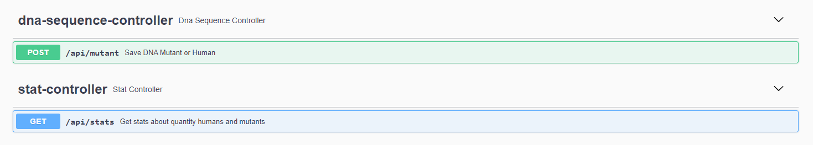
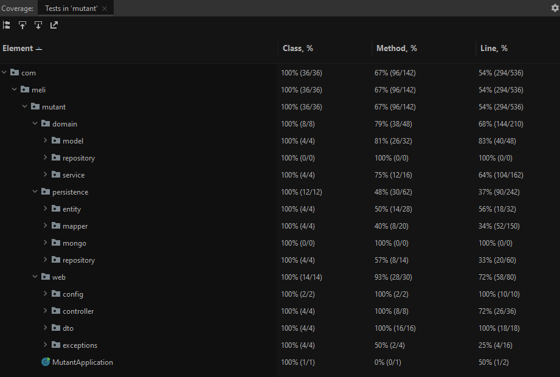
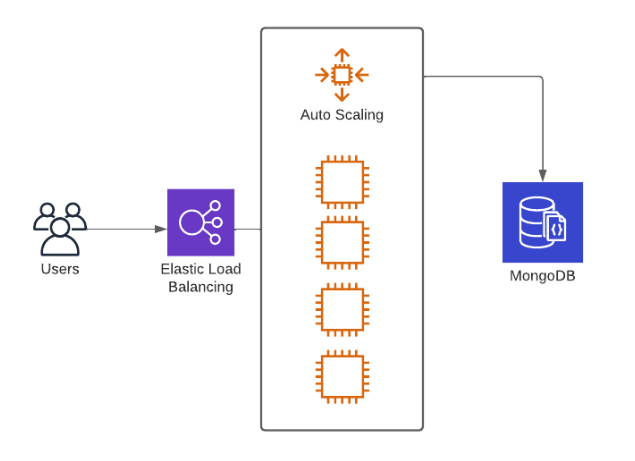
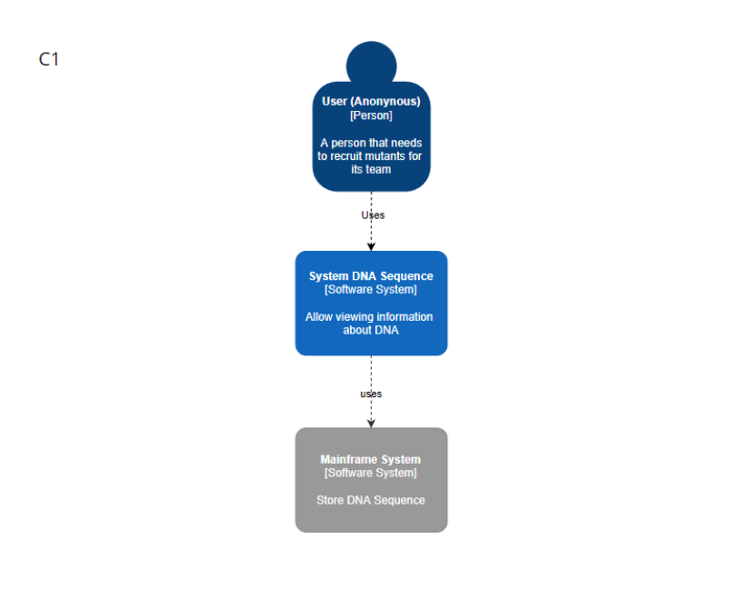
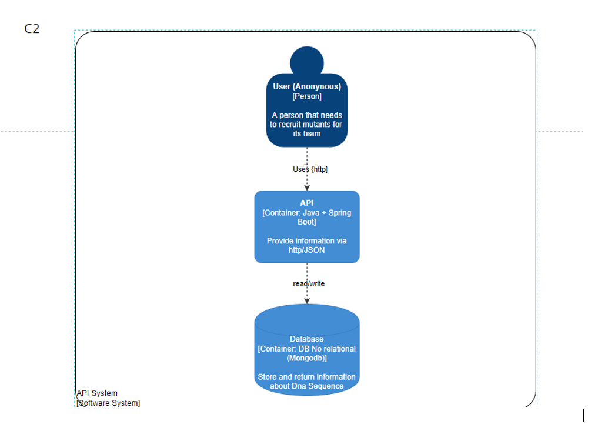
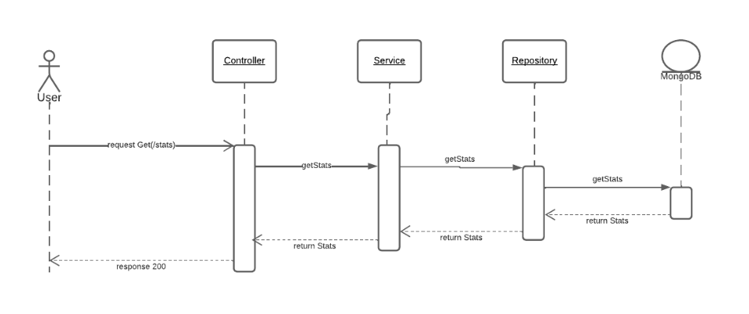
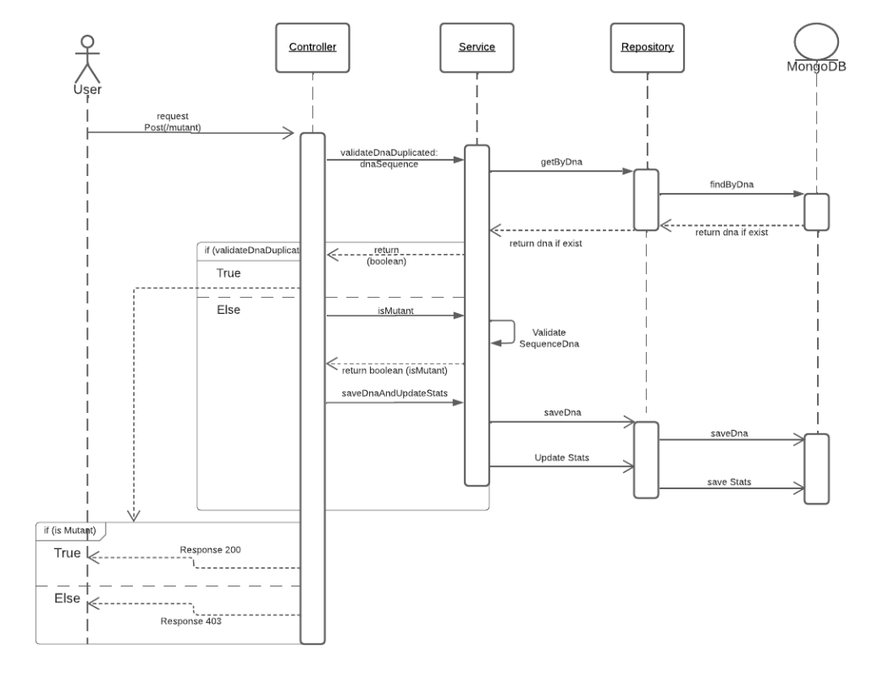

# DNA Sequence

## Resumen
Magneto quiere reclutar la mayor cantidad de mutantes para poder lucharcontra los X-Mens y necesita detectar si un humano es mutante basándose en su secuencia de ADN.

## Caracteristicas

- Dada una secuencia de ADN se valida si es humano o mutante
- Solo deben contener las letras  (A,T,C,G),
- La secuencia de ADN contiene cuatro letras consecutivas y es valida en forma horizontal vertical y diagonal (Mutante)

## Tecnologias

En el proyecto se utilizaron las siguientes tecnologias por lo tanto se necesita tenerlas instaladas

- [Spring Boot](https://spring.io/projects/spring-boot)
- [JAVA 11](https://www.oracle.com/co/java/technologies/javase/jdk11-archive-downloads.html)
- [MongoDB](https://www.mongodb.com/)
- [Gradle](https://gradle.org/)
- [IntelliJ IDEA](https://www.jetbrains.com/es-es/idea/)


## Instalación
Se requiere clonar el repositorio https://github.com/PFranciscoRojas/meli-mutant
```sh
git clone https://github.com/PFranciscoRojas/meli-mutant
```
Abrir el proyecto y descargar las dependencias.
Ejecutar los test
```sh
./gradlew test
```
Descargar e instalar mongo para ejecutar **localmente** : [Descargar MongoDb](https://www.mongodb.com/try/download/community)
Cuando se tenga instalado mongo conectarse la uri por defecto
```sh
mongodb://localhost:27017
```
Es necesario crear la base de datos y su collection usando la terminal de mongo
```sh
use mutantdb
db.stats_db.insertOne({"count_mutant_dna":0,"count_human_dna":0,"ratio":0})
```
Ejecutar la aplicación puerto 8081 por defecto
```sh
./gradlew bootRun
```
## Uso REST API


### Obtener Stats

**Request**
```sh
GET /api/stats/
```

**Response**

```sh
HTTP/1.1 200 OK
{
    "count_mutant_dna": 0,
    "count_human_dna": 0,
    "ratio": 0.0
}
```

### Guardar DNA Sequence
**Request**

```sh
POST /api/mutant/
{
    "dna":["ATGCGA","CAGTGC","TTATGT","AGAAGG","CCCCTA","TCACTG"]
}
```
Si la cadena de strings contiene ADN mutante respondera
```sh
HTTP/1.1 200 OK
```

Si la cadena de strings **no** contiene ADN mutante respondera

```sh
HTTP/1.1 403 Forbidden
```

Si la estructura de los string enviados no corresponde al especificado enviara una respuesta

```sh
HTTP/1.1 400 Bad Request
{
    "url": "uri=/api/mutant/",
    "status": "BAD_REQUEST",
    "timestamp": "2022-07-14T23:55:29.6626814",
    "message": "Sequence Dna contain strings with different size"
}

### Url API AWS

Aws proporciona una IP publica en la que esta instalado el servicio y se conecta por el puerto 8080

```sh
    Direccion IP AWS
    54.211.75.157:8080
```

### Documentación API con Swagger

```sh
http://localhost:8081/swagger-ui/index.html
```


### Cobertura de prueba (Test Coverage)

- 100%




## Arquitectura
### Diseño Detallado
#### Porque se uso MongoDB

Necesitamos abarcar una base de datos que soporte una cantidad agresiva de peticiones y de forma asincrona, una base de datos relacional no aplica ya que su escalamiento solo se podria dar de forma horizontal, así que se opta por una bd no relacional basada en documentos, para seleccionarla se tiene en cuenta el teorema [CAP](https://es.wikipedia.org/wiki/Teorema_CAP) en la que se prioriza la consistencia y la tolerancia a particiones y MongoDB encaja a la perfeccion al ser un sistema de "mono-maestro".

### Cloud

Para el despliegue en cloid se utilizo AWS en el que se crea una instancia EC2 con autoescalamiento hasta 4 (versión tier free) y un balanceador de carga clasico el cual se encargara de distribuir el trafico de manera automatica. Para la base de datos se utilizo MongoDB Atlas.



### Arquitectura C4

Para la representación visual solo se utilizaron las dos primeras capas del modelo C4 ya que al ser una sencilla con pocos endpoints se tiene una clara forma de comunicar el requerimiento.



### Diagramas de secuencia

Un diagrama de secuencia muestra como se comunican los objetos intercambian mensajes entre si, esto nos detalla el comportamiento de nuestra aplicacion.

**Request GET**



**Request POST**



## Estructura del Proyecto

La estructura de carpetas utilizada es orientada al Dominio en la que tenemos 3 principales que son los controladores, repositorios y los servicios. Esto nos permite un bajo acoplamiento ya que las dependencias se hace entre la capa contigua de esta manera hay independencia entre las capas y modulos.


