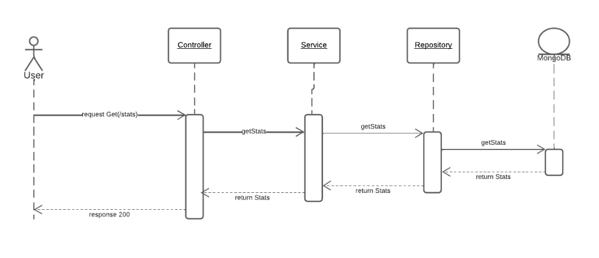

# DNA Sequence

## Resumen
Magneto quiere reclutar la mayor cantidad de mutantes para poder luchar contra los X-Mens y necesita detectar si un humano es mutante basándose en su secuencia de ADN.

## Características 

- Dada una secuencia de ADN se valida si es humano o mutante
- Solo deben contener las letras (A,T,C,G),
- La secuencia de ADN contiene cuatro letras consecutivas y es válida en forma horizontal vertical y diagonal (Mutante)

## Tecnologías 

En el proyecto se utilizaron las siguientes tecnologías por lo tanto se necesita tenerlas instaladas

- [Spring Boot](https://spring.io/projects/spring-boot)
- [JAVA 11](https://www.oracle.com/co/java/technologies/javase/jdk11-archive-downloads.html)
- [MongoDB](https://www.mongodb.com/)
- [Gradle](https://gradle.org/)
- [IntelliJ IDEA](https://www.jetbrains.com/es-es/idea/)


## Instalación

Se requiere clonar el repositorio https://github.com/PFranciscoRojas/meli-mutant

```sh
git clone https://github.com/PFranciscoRojas/meli-mutant
```

Abrir el proyecto y descargar las dependencias.
Ejecutar los test

```sh
./gradlew test
```

Descargar e instalar mongo para ejecutar **localmente** : [Descargar MongoDb](https://www.mongodb.com/try/download/community)
Cuando se tenga instalado mongo conectarse la uri por defecto
```sh
mongodb://localhost:27017
```

Es necesario crear la base de datos y su collección usando la terminal de mongo

```sh
use mutantdb
db.stats_db.insertOne({"count_mutant_dna":0,"count_human_dna":0,"ratio":0})
```

Ejecutar la aplicación puerto 8081 por defecto

```sh
./gradlew bootRun
```

## Uso REST API

### Obtener Stats
**Request**
```sh
GET /api/stats/
```

**Response**

```sh
HTTP/1.1 200 OK
{
    "count_mutant_dna": 0,
    "count_human_dna": 0,
    "ratio": 0.0
}
```

### Guardar DNA Sequence
**Request**

```sh
POST /api/mutant/
{
    "dna":["ATGCGA","CAGTGC","TTATGT","AGAAGG","CCCCTA","TCACTG"]
}
```
Si la cadena de strings contiene ADN mutante, respondera
```sh
HTTP/1.1 200 OK
{
    "idDnaSequence": "62d1cf5843f28532ea665bc8",
    "dna": [
        "ATGCGA",
        "CAGTGC",
        "TTATGT",
        "AGAAGG",
        "CCCCTA",
        "TCACTG"
    ],
    "mutant": true
}
```

Si la cadena de strings **no** contiene ADN mutante, respondera

```sh
HTTP/1.1 403 Forbidden
{
    "idDnaSequence": "62d1d4e03194a26b5bc82f64",
    "dna": [
        "CTGCGA",
        "CACTTC",
        "TGATGT",
        "CAGGGC",
        "CACCAC",
        "TCACTG"
    ],
    "mutant": false
}
```

Si la estructura de los string enviados no corresponde al especificado, enviará una respuesta

```sh
HTTP/1.1 400 Bad Request
{
    "url": "uri=/api/mutant/",
    "status": "BAD_REQUEST",
    "timestamp": "2022-07-14T23:55:29.6626814",
    "message": "Sequence Dna contain strings with different size"
}
```

### Dirección API AWS

Aws proporciona una IP pública en la que está instalado el servicio y se conecta por el puerto 8080

**54.211.75.157:8080**

```sh
GET  54.211.75.157:8080/api/stats
POST 54.211.75.157:8080/api/mutant/
```

### Documentación API con Swagger

```sh
http://localhost:8081/swagger-ui/index.html
```


### Cobertura de prueba (Test Coverage)

- 100%


## Arquitectura
### Diseño Detallado
#### Porqué se uso MongoDB?

Necesitamos abarcar una base de datos que soporte una cantidad agresiva de peticiones y de forma asíncrona,por ello una base de datos relacional no aplica ya que su escalamiento solo se podría dar de forma vertical, en ese sentido, se opta por una base de datos no relacional basada en documentos, para seleccionarla se tiene en cuenta el teorema [CAP](https://es.wikipedia.org/wiki/Teorema_CAP) en la que se prioriza la consistencia y la tolerancia a particiones, por esto MongoDB encaja a la perfección al ser un sistema "mono-maestro".

### Cloud

Para el despliegue en cloud se utiliza AWS en el que se crea una instancia EC2 con auto escalamiento hasta 4 (versión tier free) y un balanceador de carga clásico el cual se encargará de distribuir el tráfico de manera automática. Para la base de datos se utilizó MongoDB Atlas.


### Arquitectura C4

Para la representación visual solo se utilizaron las dos primeras capas del modelo C4 ya que al ser una aplicación sencilla con pocos endpoints se tiene una clara forma de comunicar el requerimiento.


### Diagramas de secuencia

Un diagrama de secuencia muestra cómo se comunican los objetos, por medio de la misma se logra reconocer la manera en la que intercambian mensajes entre sí, detallando el comportamiento de nuestra aplicación.

**Request GET**



**Request POST**


## Estructura del Proyecto

La estructura de carpetas utilizada es orientada al Dominio, y se incluye una arquitectura limpia en la que intervienen 3 capas principales: Controladores, Repositorios y los Servicios. Esto nos permite un bajo acoplamiento ya que las dependencias solo se hacen entre la capa contigua de nivel inferior, de esta manera hay independencia entre los módulos.


